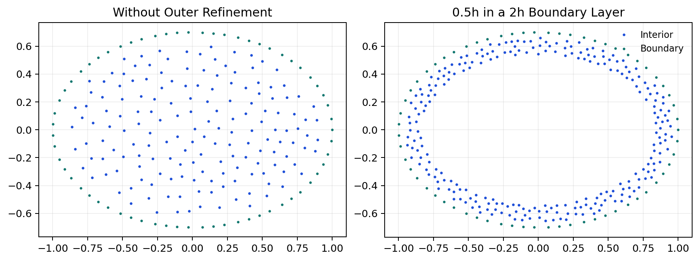

# kernelpack-jax

[](https://github.com/VarShankar/kernelpack-jax/actions/workflows/python.yml)
[](https://github.com/VarShankar/kernelpack-jax/releases/latest)
[](LICENSE)
[](#requirements)

**JAX-native meshfree geometry, RBF-FD, partition-of-unity methods, and PDE
solvers.**

`kernelpack-jax` provides differentiable numerical kernels and GPU-capable
implementations of the core KernelPack workflow: construct geometry, generate
scattered nodes, assemble PHS+polynomial RBF-FD or weighted-least-squares
operators, and solve PDEs on fixed or time-varying domains.

The moving-domain implementation accompanies the published method
[*An efficient high-order meshless method for advection-diffusion equations on
time-varying irregular domains*](https://doi.org/10.1016/j.jcp.2021.110633)
by Varun Shankar, Grady B. Wright, and Aaron L. Fogelson. The package follows
the same public numerical scope as
[`kernelpack-matlab`](https://github.com/VarShankar/kernelpack-matlab) and
[`kernelpack-python`](https://github.com/VarShankar/kernelpack-python), with
JAX transformations and optional Warp acceleration where they are useful.



[Install](#installation) | [First solve](#first-solve) |
[Moving domains](#moving-domain-pdes) | [Examples](#examples) |
[Tests](#verification) | [Papers](#research-foundations) |
[Citation](#citation)

## Who this is for

This package is intended for numerical PDE researchers and JAX users who want
to:

- prototype PHS+poly RBF-FD or weighted-least-squares discretizations;
- generate scattered nodes and differential operators on embedded domains;
- solve elliptic and diffusion problems without constructing a volume mesh;
- study advection--diffusion--reaction equations on domains with moving
  embedded boundaries; or
- differentiate fixed-discretization PDE solves with respect to continuous
  coefficients, source terms, boundary data, and initial conditions.

It is a research codebase rather than a general-purpose finite-element package.
Node generation and neighborhood selection are discrete preprocessing steps;
the fixed stencil algebra and supported solver kernels are JAX computations.

## At a glance

| Component | What the public release provides |
| --- | --- |
| Geometry models | Smooth and piecewise-smooth embedded boundaries, RBF level sets, parametric SBF fits, and cached moving-boundary SBF models |
| Node generation | Seeded fixed- and variable-radius Poisson sampling, level-set clipping, boundary and ghost nodes, boundary-zone refinement, and dual node sets |
| Local approximation | Legendre polynomial bases, standard and overlapped PHS+poly RBF-FD, weighted least squares, and divergence-free PHS interpolation |
| Fixed-domain solvers | Poisson, variable and nonlinear variable-coefficient Poisson, BDF1--BDF3 diffusion, localized PU diffusion, and multispecies PU diffusion |
| Moving-domain ADR | Semi-Lagrangian BDF1--BDF3 transport, RK3 boundary motion, cached SBF reconstruction, carve/refill updates, selective RBF-FD updates, and implicit diffusion--reaction solves in two and three dimensions |
| Acceleration | JIT-compiled and vectorized local kernels, sparse COO operators, and optional Warp hash-grid sampling and neighbor searches |

The main namespaces are `kernelpack.geometry`, `kernelpack.nodes`,
`kernelpack.domain`, `kernelpack.poly`, `kernelpack.rbffd`,
`kernelpack.divfree`, `kernelpack.accelerators`, and `kernelpack.solvers`.

## Requirements

- Python 3.13
- JAX 0.10 with 64-bit mode enabled by the package
- NumPy, SciPy, and Lineax
- Warp is optional and enables GPU spatial-search and node-generation paths
- Matplotlib is optional and used only by plotting examples

The default installation uses the JAX wheel selected by `pip`. For CUDA,
install the appropriate JAX build for the machine first, following the JAX
installation documentation, and then install `kernelpack-jax`.

## Installation

```bash
git clone https://github.com/VarShankar/kernelpack-jax.git
cd kernelpack-jax
python -m venv .venv
python -m pip install -e .[dev,examples]
```

Install optional Warp support with:

```bash
python -m pip install -e .[warp]
```

## First solve

This example builds an ellipse, generates interior and ghost nodes, and solves
Poisson's equation with Dirichlet data.

```python
import jax.numpy as jnp

from kernelpack.geometry import EmbeddedSurface
from kernelpack.nodes import DomainNodeGenerator
from kernelpack.solvers import PoissonSolver

t = jnp.linspace(0.0, 2.0 * jnp.pi, 120, endpoint=False)
surface = EmbeddedSurface()
surface.set_data_sites(jnp.column_stack([jnp.cos(t), 0.7 * jnp.sin(t)]))
surface.build_closed_geometric_model_ps(2, 0.06, t.size)
surface.build_level_set_from_geometric_model()

domain = DomainNodeGenerator().build_domain_descriptor_from_geometry(
    surface,
    0.08,
    seed=17,
    strip_count=5,
    do_outer_refinement=True,
)

solver = PoissonSolver(
    lap_assembler="fd",
    bc_assembler="fd",
    lap_stencil="rbf",
    bc_stencil="rbf",
)
solver.init(domain, 4)
result = solver.solve(
    lambda x: -4.0 * jnp.ones(x.shape[0]),
    lambda xb: jnp.zeros(xb.shape[0]),
    lambda xb: jnp.ones(xb.shape[0]),
    lambda alpha, beta, normals, xb: xb[:, 0] ** 2 + xb[:, 1] ** 2,
)
u = result["u"]
```


## Moving-domain PDEs

`MovingDomainADRSolver` advances

\[
\frac{D c}{D t}=\nu\Delta c+\lambda c+f
\]

on a domain with moving embedded boundaries. Boundary seed sites are advanced
with RK3, cached SBF models reconstruct the updated geometry, and level-set
tests update the active background cloud. Local interpolation and overlapped
RBF-FD records are reused when their stencils remain unchanged and rebuilt only
near geometric changes. BDF1--BDF3 characteristic history terms are coupled to
an implicit diffusion--reaction solve with mixed boundary conditions.

Run the compact two-dimensional example with:

```bash
python scripts/moving_domain_adr_example.py
```

Exercise the same dimension-generic solver on the three-dimensional
manufactured problem with:

```bash
python scripts/moving_domain_adr_3d_example.py --h 0.12 --xi 4 --peclet 1000
```

The benchmark reports setup, cold-step, warm-step, operator-update, and linear
solve timings separately:

```bash
python scripts/benchmark_moving_domain_adr.py --h 0.02 --steps 3
```

## Differentiability

Geometry evaluation, local stencil algebra, sparse operator application, and
supported fixed-discretization solver steps use JAX arrays and transformations.
Differentiation is intended for continuous problem data on a fixed node cloud
and stencil graph. Poisson-node generation, nearest-neighbor selection, and
moving-domain carve/refill events change discrete topology and are deliberately
kept outside traced regions.

## Examples

| Goal | Example |
| --- | --- |
| Reproduce fixed-domain Poisson convergence | [`poisson_convergence_study.py`](scripts/poisson_convergence_study.py) |
| Generate README geometry and solver figures | [`render_readme_examples.py`](scripts/render_readme_examples.py) |
| Solve moving-domain ADR in two dimensions | [`moving_domain_adr_example.py`](scripts/moving_domain_adr_example.py) |
| Solve the manufactured three-dimensional problem | [`moving_domain_adr_3d_example.py`](scripts/moving_domain_adr_3d_example.py) |
| Profile moving-domain cold and warm steps | [`benchmark_moving_domain_adr.py`](scripts/benchmark_moving_domain_adr.py) |

## Verification

Run the public suite from the repository root:

```bash
python -m pytest -q
```

Build and inspect the distributable package with:

```bash
python -m build
```

The same CPU suite and package build run in GitHub Actions on every push and
pull request. Warp/CUDA execution is optional and is validated separately on a
GPU-capable machine.

## Research foundations

Please cite the publications corresponding to the parts of the library used in
your work.

| Code or method | Publication |
| --- | --- |
| Overlapped RBF-FD assembly | V. Shankar, [*The overlapped radial basis function-finite difference (RBF-FD) method: A generalization of RBF-FD*](https://doi.org/10.1016/j.jcp.2017.04.037), Journal of Computational Physics 342 (2017), 211--228 |
| SBF geometry and Poisson node generation | V. Shankar, R. M. Kirby, and A. L. Fogelson, [*Robust node generation for mesh-free discretizations on irregular domains and surfaces*](https://doi.org/10.1137/17M114090X), SIAM Journal on Scientific Computing 40 (2018), A2584--A2608 |
| Bulk-domain hyperviscosity and PHS-degree selection | V. Shankar and A. L. Fogelson, [*Hyperviscosity-based stabilization for radial basis function-finite difference (RBF-FD) discretizations of advection-diffusion equations*](https://doi.org/10.1016/j.jcp.2018.06.036), Journal of Computational Physics 372 (2018), 616--639 |
| Moving-domain ADR and differentiation-matrix updates | V. Shankar, G. B. Wright, and A. L. Fogelson, [*An efficient high-order meshless method for advection-diffusion equations on time-varying irregular domains*](https://doi.org/10.1016/j.jcp.2021.110633), Journal of Computational Physics 445 (2021), 110633 |

## Citation

Software citation metadata are provided in [`CITATION.cff`](CITATION.cff). If
you use the moving-domain solver, please also cite:

> Varun Shankar, Grady B. Wright, and Aaron L. Fogelson. "An efficient
> high-order meshless method for advection-diffusion equations on time-varying
> irregular domains." Journal of Computational Physics 445, 110633, 2021.
> [doi:10.1016/j.jcp.2021.110633](https://doi.org/10.1016/j.jcp.2021.110633)

## Contributing

Bug reports, focused pull requests, and reproducible numerical examples are
welcome. See [`CONTRIBUTING.md`](CONTRIBUTING.md) and
[`SECURITY.md`](SECURITY.md).

## License

`kernelpack-jax` is released under the [BSD 3-Clause License](LICENSE), which
permits academic and commercial use, modification, and redistribution subject
to its terms.
