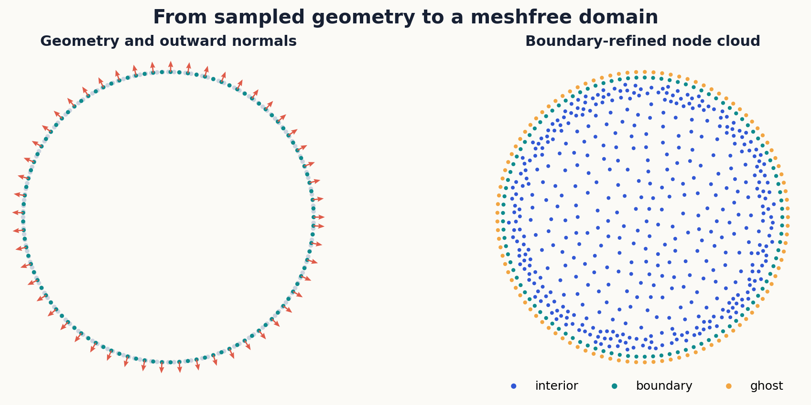
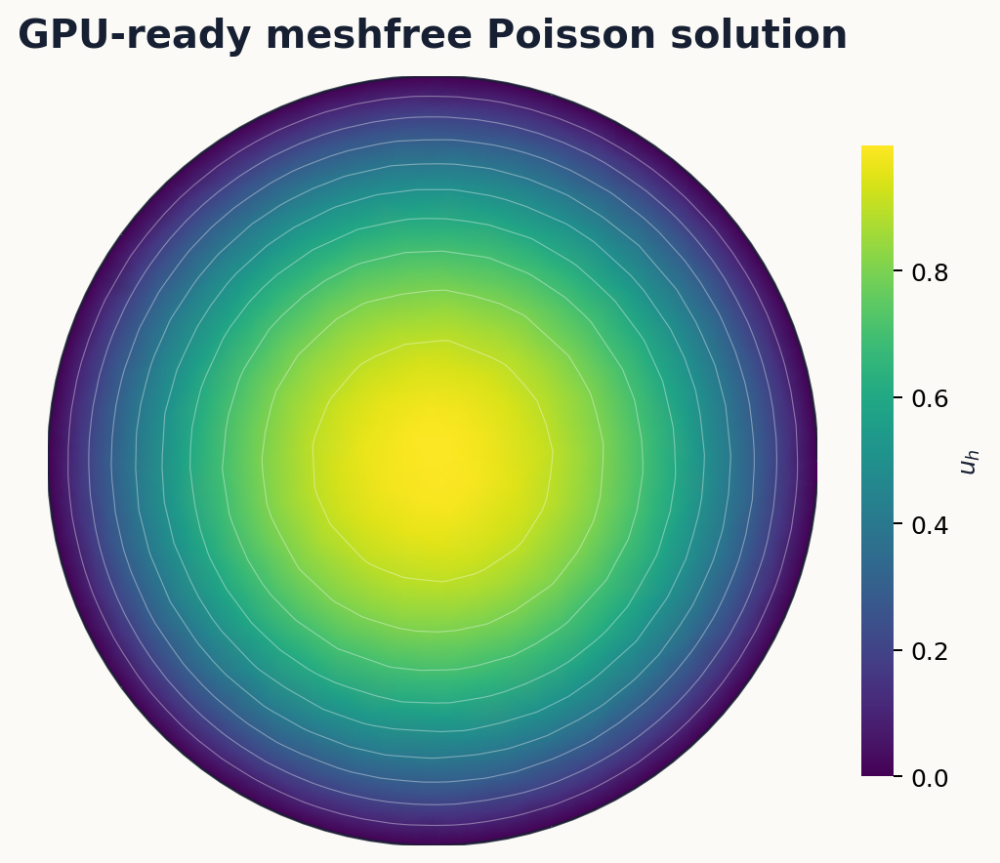

# kernelpack-jax

[](https://github.com/VarShankar/kernelpack-jax/actions/workflows/python.yml)
[](https://github.com/VarShankar/kernelpack-jax/releases/latest)
[](LICENSE)
[](#requirements)

**JAX-native meshfree geometry, RBF-FD, partition-of-unity methods, and PDE
solvers.**

`kernelpack-jax` is the accelerator-oriented member of the KernelPack family.
It brings meshfree geometry, scattered-node generation, polynomial tools,
RBF-FD, partition-of-unity approximation, and PDE solvers into a JAX codebase
designed for transformation with `jit`, `vmap`, and automatic differentiation.
Companion implementations are available in
[`kernelpack-matlab`](https://github.com/VarShankar/kernelpack-matlab) and
[`kernelpack-python`](https://github.com/VarShankar/kernelpack-python).



The figure shows the geometry pipeline used by the PDE solvers: an embedded
boundary and its normals define a level set, and the node generator fills the
interior while retaining boundary and ghost-node structure.

[Install](#installation) | [First solve](#first-solve) |
[Moving domains](#moving-domain-pdes) | [Moving surfaces](#moving-surface-pdes) |
[Examples](#examples) |
[Tests](#verification) | [Papers](#research-foundations) |
[Citation](#citation)

## What it includes

- Geometry models for smooth and piecewise-smooth embedded boundaries and
  surfaces, including RBF level sets and parametric SBF representations
- Seeded fixed- and variable-radius Poisson node generation, geometry-aware
  clipping, boundary refinement, ghost nodes, and dual node sets
- Shared Legendre polynomial and multi-index utilities
- Standard and overlapped PHS+poly RBF-FD, weighted least squares, localized
  partition-of-unity approximation, and divergence-free interpolation
- Fixed-domain Poisson, variable and nonlinear variable-coefficient Poisson,
  BDF diffusion, localized PU diffusion, and multispecies diffusion solvers
- Semi-Lagrangian BDF1--BDF3 advection--diffusion--reaction on domains with
  moving embedded boundaries in two and three dimensions
- Tangent-plane RBF-FD operators for stationary and moving surfaces, including
  defect-corrected updates, hyperviscosity, quadrature, mass projection,
  marker rearrangement, and history backfill
- Mean-curvature flow and transport on externally generated material
  trajectories
- JIT-compiled and `vmap`-batched kernels, sparse JAX operators, and optional
  Warp acceleration for spatial searches and node generation

The main namespaces are `kernelpack.geometry`, `kernelpack.nodes`,
`kernelpack.domain`, `kernelpack.manifold`, `kernelpack.poly`, `kernelpack.rbffd`,
`kernelpack.divfree`, `kernelpack.accelerators`, and `kernelpack.solvers`.

## Supported workflows

- Smooth and piecewise-smooth embedded geometry in two and three dimensions
- Fixed- and variable-density Poisson sampling and level-set clipping
- Standard, overlapped, weighted-least-squares, and PU local approximation
- Fixed-domain elliptic, diffusion, and multispecies diffusion problems
- Moving-domain advection--diffusion--reaction with embedded boundaries
- Conservative transport and reaction--diffusion on stationary or evolving
  closed surfaces
- Geometric surface evolution, marker-quality monitoring, rearrangement, and
  semi-Lagrangian BDF-history reconstruction
- Fixed-discretization differentiation with respect to continuous
  coefficients, forcing, boundary data, and initial conditions

## Execution model

KernelPack keeps topology-changing setup explicit: node generation,
active-set changes, file I/O, and neighbor selection may change array shapes
or integer connectivity. Once those structures are fixed, local assembly,
operator application, geometry updates, adaptive stabilization, time stepping,
and iterative solves remain on the active JAX device and can be transformed
with `jit` or `vmap`. The package enables 64-bit mode because high-order
augmented RBF-FD systems require double precision.

## Requirements

- Python 3.13
- JAX 0.10 with 64-bit mode enabled by the package
- NumPy, SciPy, and Lineax
- Warp is optional and enables GPU spatial-search and node-generation paths
- Matplotlib is optional and used only by plotting examples

The default installation uses the JAX wheel selected by `pip`. For CUDA,
install the appropriate JAX build for the machine first, following the JAX
installation documentation, and then install `kernelpack-jax`.

## Installation

### CPU installation

```bash
git clone https://github.com/VarShankar/kernelpack-jax.git
cd kernelpack-jax
python -m venv .venv
python -m pip install -e .[dev,examples]
```

### NVIDIA GPU and Warp

Install the appropriate CUDA-enabled JAX wheel using the
[official JAX instructions](https://docs.jax.dev/en/latest/installation.html),
then add optional Warp support for GPU spatial searches:

```bash
python -m pip install -e .[warp]
```

Confirm which device will execute compiled kernels:

```bash
python -c "import jax; print(jax.default_backend(), jax.devices())"
```

The first call for a new shape and set of static options includes compilation;
benchmark warm steps separately from setup and compilation.

## First solve

This example builds an ellipse, generates interior and ghost nodes, and solves
Poisson's equation with Dirichlet data.

```python
import jax.numpy as jnp

from kernelpack.geometry import EmbeddedSurface
from kernelpack.nodes import DomainNodeGenerator
from kernelpack.solvers import PoissonSolver

t = jnp.linspace(0.0, 2.0 * jnp.pi, 120, endpoint=False)
surface = EmbeddedSurface()
surface.set_data_sites(jnp.column_stack([jnp.cos(t), 0.7 * jnp.sin(t)]))
surface.build_closed_geometric_model_ps(2, 0.06, t.size)
surface.build_level_set_from_geometric_model()

domain = DomainNodeGenerator().build_domain_descriptor_from_geometry(
    surface,
    0.08,
    seed=17,
    strip_count=5,
    do_outer_refinement=True,
)

solver = PoissonSolver(
    lap_assembler="fd",
    bc_assembler="fd",
    lap_stencil="rbf",
    bc_stencil="rbf",
)
solver.init(domain, 4)
result = solver.solve(
    lambda x: -4.0 * jnp.ones(x.shape[0]),
    lambda xb: jnp.zeros(xb.shape[0]),
    lambda xb: jnp.ones(xb.shape[0]),
    lambda alpha, beta, normals, xb: xb[:, 0] ** 2 + xb[:, 1] ** 2,
)
u = result["u"]
```



## Moving-domain PDEs

`MovingDomainADRSolver` advances

\[
\frac{D c}{D t}=\nu\Delta c+\lambda c+f
\]

on a domain with moving embedded boundaries. Boundary seed sites are advanced
with RK3, cached SBF models reconstruct the updated geometry, and level-set
tests update the active background cloud. Local interpolation and overlapped
RBF-FD records are reused when their stencils remain unchanged and rebuilt only
near geometric changes. BDF1--BDF3 characteristic history terms are coupled to
an implicit diffusion--reaction solve with mixed boundary conditions.

The solver is dimension-generic: the two- and three-dimensional examples call
the same implementation. Geometry callbacks supply the moving boundary, while
KernelPack handles level-set classification, boundary and ghost nodes,
departure-point interpolation, selective operator updates, and the global
solve. This keeps the public API independent of a particular manufactured
problem.

Run the compact two-dimensional example with:

```bash
python scripts/moving_domain_adr_example.py
```

Exercise the same dimension-generic solver on the three-dimensional
manufactured problem with:

```bash
python scripts/moving_domain_adr_3d_example.py --h 0.12 --xi 4 --peclet 1000
```

The benchmark reports setup, cold-step, warm-step, operator-update, and linear
solve timings separately:

```bash
python scripts/benchmark_moving_domain_adr.py --h 0.02 --steps 3
```

## Moving-surface PDEs

The moving-surface kernels discretize the conservative material equation

\[
\partial^\bullet c + c\,\nabla_\Gamma\!\cdot\mathbf{w}
= \nu\Delta_\Gamma c + R(c,\mathbf{x},t) + f
\]

on a closed evolving surface. Surface gradients and Laplacians use
target-centered tangent-plane PHS+Legendre RBF-FD stencils. The implementation
updates local weights by cached-factor defect correction, estimates
componentwise hyperviscosity entirely through device matvecs, and obtains
analytic normals and quadrature from cached spherical or toroidal SBF geometry
models. BDF reaction values and the numerical dilation term are extrapolated;
diffusion is implicit and solved by matrix-free JAX GMRES from the extrapolated
solution.

Topology-changing preprocessing remains outside `jit`: Warp or JAX KNN builds
the stencil graph, while operator assembly, defect updates, hyperviscosity,
RK3 motion, BDF stepping, mass projection, and local/SBF transfer are JAX array
computations. Adaptive hyperviscosity prediction and recalibration are selected
on device with `lax.cond`, and independent tracers can be advanced with
`vmap`. Trajectory file parsing and shape-changing topology decisions remain
host operations by design; they transfer fixed-shape arrays to the active JAX
device before numerical work begins.

The supporting kernels also cover quality-triggered marker rearrangement,
RK3 semi-Lagrangian history backfill, local tangent-plane or reduced-control
SBF transfer, and quadrature updates before mass projection.

Run the ten-step breathing-sphere verification on the active JAX device with:

```bash
python scripts/moving_surface_adr_breathing_sphere.py
```

The script advances a complete ten-step problem rather than testing an
isolated operator.

Stationary-surface ADR and mean-curvature flow use the same tangent-plane
operator path:

```bash
python examples/stationary_surface_adr_example.py
python examples/mean_curvature_flow_sphere_example.py
python examples/mean_curvature_flow_ellipsoid_example.py
python examples/surface_rearrangement_example.py
```

The three-dimensional red-blood-cell example replays the public IBAMR
trajectory distributed in the shared data release. The downloader verifies
the archive before installing the trajectory locally; the solver then
reconstructs SBF geometry and normals, advances a source-free diffusing tracer
with the same tangent-plane ADR machinery, enforces the quadrature mass law,
and writes the final point cloud and concentration to `artifacts/`.

```bash
python scripts/download_rbc_capstone_data.py
python examples/moving_surface_rbc_capstone.py
```

The default command processes the complete 401-frame trajectory. Use
`--steps 2` only for a short installation check.

## Examples

| Goal | Example |
| --- | --- |
| Solve Poisson's equation | [`poisson_solver_example.py`](examples/poisson_solver_example.py) |
| Solve variable and nonlinear variable-coefficient Poisson problems | [`variable_poisson_solver_example.py`](examples/variable_poisson_solver_example.py) |
| Compare FD and localized-PU diffusion | [`diffusion_solver_example.py`](examples/diffusion_solver_example.py) |
| Advance multispecies PU diffusion | [`multispecies_pu_diffusion_example.py`](examples/multispecies_pu_diffusion_example.py) |
| Reproduce fixed-domain Poisson convergence | [`poisson_convergence_study.py`](scripts/poisson_convergence_study.py) |
| Generate README geometry and solver figures | [`render_readme_examples.py`](scripts/render_readme_examples.py) |
| Solve moving-domain ADR in two dimensions | [`moving_domain_adr_example.py`](scripts/moving_domain_adr_example.py) |
| Solve the manufactured three-dimensional problem | [`moving_domain_adr_3d_example.py`](scripts/moving_domain_adr_3d_example.py) |
| Profile moving-domain cold and warm steps | [`benchmark_moving_domain_adr.py`](scripts/benchmark_moving_domain_adr.py) |
| Verify stationary-surface ADR | [`stationary_surface_adr_example.py`](examples/stationary_surface_adr_example.py) |
| Verify moving-surface ADR on a breathing sphere | [`moving_surface_adr_breathing_sphere.py`](scripts/moving_surface_adr_breathing_sphere.py) |
| Evolve a sphere by mean curvature | [`mean_curvature_flow_sphere_example.py`](examples/mean_curvature_flow_sphere_example.py) |
| Smooth an ellipsoid by mean curvature | [`mean_curvature_flow_ellipsoid_example.py`](examples/mean_curvature_flow_ellipsoid_example.py) |
| Remap markers and semi-Lagrangian-backfill BDF history | [`surface_rearrangement_example.py`](examples/surface_rearrangement_example.py) |
| Transport and diffuse a tracer on an IBAMR red-blood-cell trajectory | [`moving_surface_rbc_capstone.py`](examples/moving_surface_rbc_capstone.py) |

The corresponding test modules isolate operator reproduction, defect
correction, SBF geometry, history reconstruction, JIT/vmap behavior, and full
ADR balance checks.

## Verification

Run the public suite from the repository root:

```bash
python -m pytest -q
```

Run the moving-domain and moving-surface checks independently with:

```bash
python -m pytest -q tests/test_moving_domain_adr.py
python -m pytest -q tests/test_moving_surface_adr.py
```

To verify GPU execution rather than CPU fallback, run:

```bash
python scripts/moving_surface_adr_breathing_sphere.py
```

The example reports the selected device, relative error, linear residual, and
post-projection mass error.

Build and inspect the distributable package with:

```bash
python -m build
```

The same CPU suite and package build run in GitHub Actions on every push and
pull request. Warp/CUDA execution is optional and is validated separately on a
GPU-capable machine.

## Research foundations

Please cite the publications corresponding to the parts of the library used in
your work.

| Code or method | Publication |
| --- | --- |
| Surface RBF-FD foundations | V. Shankar, G. B. Wright, R. M. Kirby, and A. L. Fogelson, [*A radial basis function (RBF)-finite difference (FD) method for diffusion and reaction-diffusion equations on surfaces*](https://doi.org/10.1007/s10915-014-9914-1), Journal of Scientific Computing 63 (2015), 745--768 |
| Overlapped RBF-FD assembly | V. Shankar, [*The overlapped radial basis function-finite difference (RBF-FD) method: A generalization of RBF-FD*](https://doi.org/10.1016/j.jcp.2017.04.037), Journal of Computational Physics 342 (2017), 211--228 |
| SBF geometry and Poisson node generation | V. Shankar, R. M. Kirby, and A. L. Fogelson, [*Robust node generation for mesh-free discretizations on irregular domains and surfaces*](https://doi.org/10.1137/17M114090X), SIAM Journal on Scientific Computing 40 (2018), A2584--A2608 |
| Bulk-domain hyperviscosity and PHS-degree selection | V. Shankar and A. L. Fogelson, [*Hyperviscosity-based stabilization for radial basis function-finite difference (RBF-FD) discretizations of advection-diffusion equations*](https://doi.org/10.1016/j.jcp.2018.06.036), Journal of Computational Physics 372 (2018), 616--639 |
| Hyperviscosity for surface transport | V. Shankar, G. B. Wright, and A. Narayan, [*A robust hyperviscosity formulation for stable RBF-FD discretizations of advection-diffusion-reaction equations on manifolds*](https://doi.org/10.1137/19M1288747), SIAM Journal on Scientific Computing 42 (2020), A2371--A2401 |
| Moving-domain ADR and differentiation-matrix updates | V. Shankar, G. B. Wright, and A. L. Fogelson, [*An efficient high-order meshless method for advection-diffusion equations on time-varying irregular domains*](https://doi.org/10.1016/j.jcp.2021.110633), Journal of Computational Physics 445 (2021), 110633 |
| Moving-surface ADR | M. Lowery, G. B. Wright, and V. Shankar, [*A high-order, meshless, Lagrangian--Eulerian RBF-FD method for advection--diffusion--reaction on moving manifolds*](https://doi.org/10.48550/arXiv.2608.19384), arXiv:2608.19384 (2026) |

## Citation

Software citation metadata are provided in [`CITATION.cff`](CITATION.cff).
Please also cite the method papers corresponding to the components used in
your work.

## Contributing

Bug reports, focused pull requests, and reproducible numerical examples are
welcome. See [`CONTRIBUTING.md`](CONTRIBUTING.md) and
[`SECURITY.md`](SECURITY.md).

## License

`kernelpack-jax` is released under the [BSD 3-Clause License](LICENSE), which
permits academic and commercial use, modification, and redistribution subject
to its terms.
