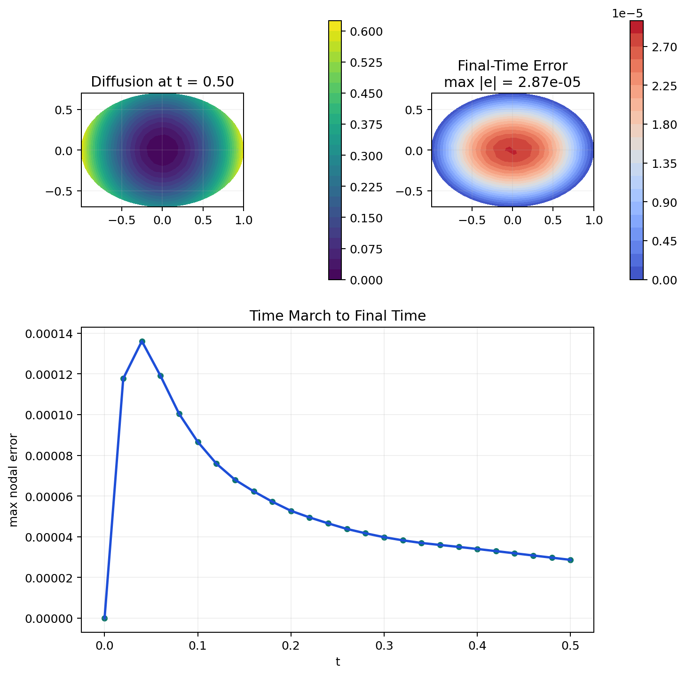

# kernelpack-jax

[](https://github.com/VarShankar/kernelpack-jax/actions/workflows/python.yml)
[](https://github.com/VarShankar/kernelpack-jax/releases/latest)
[](LICENSE)
[](#requirements)

**High-order meshfree numerics, from sampled geometry to accelerator-executed
PDE solution.**

`kernelpack-jax` is the JAX implementation of the
[KernelPack](https://github.com/VarShankar/kernelpack) numerical toolkit. Its
purpose is to make modern meshfree methods usable as a coherent computational
stack: represent an irregular geometry, generate a well-spaced point cloud,
construct polynomially augmented local operators, and solve PDEs on fixed or
evolving domains and surfaces.

The library consolidates a broader research program in node generation,
geometric modeling, RBF-FD, partition-of-unity approximation, stabilization,
and PDEs on moving geometries. The JAX implementation targets repeated,
fixed-shape numerical work on CPUs and accelerators through `jit`, `vmap`,
matrix-free operators, and optional Warp spatial primitives.


[Approach](#the-kernelpack-approach) | [Capabilities](#numerical-stack) |
[Install](#installation) | [Quick start](#quick-start) |
[Workflows](#core-workflows) | [Examples](#examples) |
[Verification](#verification) | [Papers](#research-foundations)

## The KernelPack approach

KernelPack organizes a meshfree discretization into reusable numerical layers:

1. **Geometry.** Fit smooth or piecewise-smooth models to sampled boundaries
   and surfaces; evaluate positions, normals, projections, and level sets.
2. **Nodes.** Generate quasi-uniform or variable-density Poisson point clouds,
   then classify interior, boundary, ghost, and dual nodes from the geometry.
3. **Approximation.** Combine lower odd-degree polyharmonic splines with
   centered and scaled polynomial reproduction to build local RBF-FD,
   overlapped RBF-FD, weighted-least-squares, PU, and interpolation operators.
4. **PDEs.** Reuse the same domain descriptors and local approximation tools in
   elliptic, parabolic, advection-diffusion-reaction, and surface solvers.
5. **Evolution.** Update geometry, point clouds, operators, stabilization, and
   solution histories when a domain or manifold moves.

The result is a path from scattered geometric data to high-order PDE solvers
without constructing a conforming volume mesh.

## The KernelPack family

The repositories are sibling implementations of the same numerical ideas, not
language bindings and not exact API replicas.

| Implementation | Best suited for | Computational model |
| --- | --- | --- |
| [`kernelpack-matlab`](https://github.com/VarShankar/kernelpack-matlab) | Numerical-method development, transparent research prototypes, convergence studies, and publication workflows | MATLAB sparse linear algebra, vectorized kernels, and optional `parfor` assembly |
| [`kernelpack-python`](https://github.com/VarShankar/kernelpack-python) | Conventional scientific-Python applications and CPU workflows | NumPy/SciPy with Numba-compiled local kernels |
| **JAX** (this repository) | Accelerator execution, batched studies, and fixed-topology differentiable computation | JAX `jit`/`vmap` kernels with optional Warp spatial primitives |

All three follow the same geometry -> nodes -> operators -> solvers
architecture. Features may arrive in one implementation before the others.

## Numerical stack

| Layer | JAX implementation |
| --- | --- |
| Geometry | Smooth and piecewise-smooth embedded geometry, PHS fits, RBF level sets, projections, normals, parametric spherical and toroidal SBF models, and externally supplied material trajectories |
| Nodes and domains | Fixed- and variable-radius Poisson sampling, level-set clipping, boundary refinement, interior/boundary/ghost bookkeeping, dual node sets, JAX KNN, and optional Warp searches |
| Polynomial tools | JIT-compatible Jacobi and Legendre recurrences, total-degree multi-indices, and centered/scaled polynomial evaluation |
| Local approximation | Standard and overlapped PHS+poly RBF-FD, cross-node operators, weighted least squares, localized PU approximation, frozen stencil graphs, and divergence-free interpolation |
| Fixed-domain PDEs | Poisson, variable and nonlinear variable-coefficient Poisson, BDF diffusion, scalar PU diffusion, and multispecies PU diffusion |
| Moving-domain PDEs | Semi-Lagrangian BDF1--BDF3 advection-diffusion-reaction with evolving embedded boundaries in two and three dimensions |
| Surface PDEs | Tangent-plane RBF-FD on stationary and moving manifolds, defect-corrected operator updates, surface hyperviscosity, geometry-based quadrature, conservation projection, marker rearrangement, and history backfill |
| Geometric evolution | Mean-curvature flow and interpolation of externally generated material-surface trajectories |
| Accelerator execution | JAX x64, `jit`, `vmap`, `lax` control flow, matrix-free Krylov solves, sparse operators, and optional Warp spatial kernels |

The primary namespaces are `kernelpack.geometry`, `kernelpack.nodes`,
`kernelpack.domain`, `kernelpack.poly`, `kernelpack.rbffd`,
`kernelpack.divfree`, `kernelpack.manifold`, `kernelpack.accelerators`, and
`kernelpack.solvers`.

### Execution boundary

Node-set changes, file I/O, and decisions that alter array shapes or integer
connectivity are explicit setup or orchestration steps. Once geometry and
stencil graphs have fixed shapes, polynomial evaluation, local assembly,
operator application, defect updates, stabilization, time stepping, and
iterative solves remain JAX array computations on the active device. This
boundary keeps the compute-intensive path compilable without pretending that
dynamic topology is a static array operation.

The package enables 64-bit mode because high-order augmented RBF-FD systems
require double precision.

## Requirements

- Python 3.13
- JAX and `jaxlib` 0.10 with 64-bit mode enabled by the package
- NumPy, SciPy, and Lineax for packaging, setup, and supporting linear algebra
- Warp is optional and provides GPU spatial-search and node-generation paths
- Matplotlib is optional and used only by examples and figure scripts

The default installation uses the JAX wheel selected by `pip`. For CUDA,
install the appropriate JAX build for the machine first, following the
[official JAX installation guide](https://docs.jax.dev/en/latest/installation.html).

## Installation

Create a CPU development environment with:

```bash
git clone https://github.com/VarShankar/kernelpack-jax.git
cd kernelpack-jax
python -m venv .venv
```

Activate it with `source .venv/bin/activate` on macOS or Linux, or with
`.venv\Scripts\Activate.ps1` on Windows. Then install the development and
example dependencies:

```bash
python -m pip install -e ".[dev,examples]"
```

For NVIDIA GPU execution, install the matching CUDA-enabled JAX wheel first,
then install KernelPack and optional Warp support:

```bash
python -m pip install -e ".[warp]"
python -c "import jax; print(jax.default_backend(), jax.devices())"
```

The first call for a new shape and static configuration includes compilation.
Benchmark warm execution separately from setup and compilation.

## Quick start

The following example samples an ellipse, builds a meshfree domain, and solves
Poisson's equation with Dirichlet data.


```python
import jax.numpy as jnp

from kernelpack.geometry import EmbeddedSurface
from kernelpack.nodes import DomainNodeGenerator
from kernelpack.solvers import PoissonSolver

t = jnp.linspace(0.0, 2.0 * jnp.pi, 120, endpoint=False)
surface = EmbeddedSurface()
surface.set_data_sites(jnp.column_stack([jnp.cos(t), 0.7 * jnp.sin(t)]))
surface.build_closed_geometric_model_ps(2, 0.06, t.size)
surface.build_level_set_from_geometric_model()

domain = DomainNodeGenerator().build_domain_descriptor_from_geometry(
    surface,
    0.08,
    seed=17,
    strip_count=5,
    do_outer_refinement=True,
)

solver = PoissonSolver(
    lap_assembler="fd",
    bc_assembler="fd",
    lap_stencil="rbf",
    bc_stencil="rbf",
)
solver.init(domain, 4)
result = solver.solve(
    lambda x: -4.0 * jnp.ones(x.shape[0]),
    lambda xb: jnp.zeros(xb.shape[0]),
    lambda xb: jnp.ones(xb.shape[0]),
    lambda alpha, beta, normals, xb: xb[:, 0] ** 2 + xb[:, 1] ** 2,
)
u = result["u"]
```

## Core workflows

### Fixed domains

A `DomainDescriptor` separates geometry and node generation from the PDE. The
same descriptor can feed standard or overlapped RBF-FD, weighted-least-
squares, and localized-PU operators. Elliptic solvers support variable and
nonlinear coefficients; BDF diffusion reuses fixed operators; and PU solvers
support scalar and multispecies systems. Frozen stencil graphs keep repeated
assembly and application on fixed-shape JAX arrays.

```bash
python examples/poisson_solver_example.py
python examples/variable_poisson_solver_example.py
python examples/diffusion_solver_example.py
python examples/multispecies_pu_diffusion_example.py
```



### Moving domains

`MovingDomainADRSolver` advances advection-diffusion-reaction problems on
domains with moving embedded boundaries. RK3 advances boundary markers;
cached SBF models reconstruct the new boundary; level-set tests update the
active cloud; and local interpolation supplies semi-Lagrangian BDF1--BDF3
history values. Local interpolation and overlapped RBF-FD records are reused
where the geometry leaves their neighborhoods unchanged. The public two- and
three-dimensional drivers call the same solver.

```bash
python scripts/moving_domain_adr_example.py
python scripts/moving_domain_adr_3d_example.py --h 0.12 --xi 4 --peclet 1000
```

### Surfaces and evolving manifolds

The manifold package constructs target-centered tangent-plane PHS+Legendre
RBF-FD operators. It supports stationary-surface ADR, conservative transport
on prescribed moving surfaces, cached-factor defect updates, adaptive
hyperviscosity, SBF or PCA normals, geometry-derived quadrature, conservation
projection, marker rearrangement, and semi-Lagrangian reconstruction of
multistep history. Fixed-shape operator assembly, RK3 motion, BDF stepping,
matrix-free GMRES, mass projection, and transfer are JAX computations. The
same operator path drives mean-curvature flow.

```bash
python examples/stationary_surface_adr_example.py
python scripts/moving_surface_adr_breathing_sphere.py
python examples/mean_curvature_flow_ellipsoid_example.py
python examples/surface_rearrangement_example.py
```

The IBAMR biconcave-membrane trajectory is one application of this general
surface machinery. It is distributed separately and installed with
`python scripts/download_rbc_capstone_data.py`; the complete replay is
`examples/moving_surface_rbc_capstone.py`.

### Interpolation and vector fields

`kernelpack.divfree` provides JIT-compiled global and local divergence-free
PHS+polynomial interpolation. The shared polynomial, stencil, and search
layers can also be used directly for scattered-data approximation and custom
differential operators. For a fixed discretization, continuous coefficients,
forcing, boundary data, and initial conditions can participate in JAX
transformations.

## Examples

Complete workflows live in [`examples`](examples) and [`scripts`](scripts):

| Goal | Example |
| --- | --- |
| Solve Poisson on an embedded domain | [`poisson_solver_example.py`](examples/poisson_solver_example.py) |
| Solve variable and nonlinear variable-coefficient Poisson problems | [`variable_poisson_solver_example.py`](examples/variable_poisson_solver_example.py) |
| Compare RBF-FD and PU diffusion | [`diffusion_solver_example.py`](examples/diffusion_solver_example.py) |
| Advance multispecies PU diffusion | [`multispecies_pu_diffusion_example.py`](examples/multispecies_pu_diffusion_example.py) |
| Reproduce GPU RBF-FD convergence | [`poisson_convergence_study.py`](scripts/poisson_convergence_study.py) |
| Solve moving-domain ADR in two or three dimensions | [`moving_domain_adr_example.py`](scripts/moving_domain_adr_example.py), [`moving_domain_adr_3d_example.py`](scripts/moving_domain_adr_3d_example.py) |
| Profile moving-domain cold and warm steps | [`benchmark_moving_domain_adr.py`](scripts/benchmark_moving_domain_adr.py) |
| Verify stationary or moving surface ADR | [`stationary_surface_adr_example.py`](examples/stationary_surface_adr_example.py), [`moving_surface_adr_breathing_sphere.py`](scripts/moving_surface_adr_breathing_sphere.py) |
| Evolve surfaces by mean curvature | [`mean_curvature_flow_sphere_example.py`](examples/mean_curvature_flow_sphere_example.py), [`mean_curvature_flow_ellipsoid_example.py`](examples/mean_curvature_flow_ellipsoid_example.py) |
| Rearrange surface markers and backfill BDF history | [`surface_rearrangement_example.py`](examples/surface_rearrangement_example.py) |
| Replay transport on an IBAMR membrane trajectory | [`moving_surface_rbc_capstone.py`](examples/moving_surface_rbc_capstone.py) |

The GPU Poisson studies and their numerical results are documented in
[`docs/poisson_convergence_rbf_fd_gpu.md`](docs/poisson_convergence_rbf_fd_gpu.md)
and
[`docs/poisson_convergence_rbf_fd_gpu_ellipse.md`](docs/poisson_convergence_rbf_fd_gpu_ellipse.md).

## Verification

Run the complete public CPU suite from the repository root:

```bash
python -m pytest -q
```

Run the moving-geometry checks independently with:

```bash
python -m pytest -q tests/test_moving_domain_adr.py
python -m pytest -q tests/test_moving_surface_adr.py
```

To confirm accelerator execution rather than CPU fallback, inspect the device
reported by:

```bash
python scripts/moving_surface_adr_breathing_sphere.py
```

The public CPU suite and package build run in GitHub Actions. CUDA and Warp
execution require a compatible GPU environment and are validated separately.

## Research foundations

KernelPack consolidates methods developed across several publications. Cite
the software using [`CITATION.cff`](CITATION.cff), and cite the papers that
correspond to the components used in your work.

| Component | Publication |
| --- | --- |
| Surface RBF-FD | V. Shankar, G. B. Wright, R. M. Kirby, and A. L. Fogelson, [*A radial basis function (RBF)-finite difference (FD) method for diffusion and reaction-diffusion equations on surfaces*](https://doi.org/10.1007/s10915-014-9914-1), Journal of Scientific Computing 63 (2015), 745--768 |
| Overlapped RBF-FD | V. Shankar, [*The overlapped radial basis function-finite difference (RBF-FD) method: A generalization of RBF-FD*](https://doi.org/10.1016/j.jcp.2017.04.037), Journal of Computational Physics 342 (2017), 211--228 |
| Geometric models and Poisson node generation | V. Shankar, R. M. Kirby, and A. L. Fogelson, [*Robust node generation for mesh-free discretizations on irregular domains and surfaces*](https://doi.org/10.1137/17M114090X), SIAM Journal on Scientific Computing 40 (2018), A2584--A2608 |
| Bulk hyperviscosity and PHS-degree selection | V. Shankar and A. L. Fogelson, [*Hyperviscosity-based stabilization for radial basis function-finite difference (RBF-FD) discretizations of advection-diffusion equations*](https://doi.org/10.1016/j.jcp.2018.06.036), Journal of Computational Physics 372 (2018), 616--639 |
| Surface hyperviscosity | V. Shankar, G. B. Wright, and A. Narayan, [*A robust hyperviscosity formulation for stable RBF-FD discretizations of advection-diffusion-reaction equations on manifolds*](https://doi.org/10.1137/19M1288747), SIAM Journal on Scientific Computing 42 (2020), A2371--A2401 |
| Moving-domain ADR and matrix updates | V. Shankar, G. B. Wright, and A. L. Fogelson, [*An efficient high-order meshless method for advection-diffusion equations on time-varying irregular domains*](https://doi.org/10.1016/j.jcp.2021.110633), Journal of Computational Physics 445 (2021), 110633 |
| Lagrangian-Eulerian moving-surface ADR | M. Lowery, G. B. Wright, and V. Shankar, [*A high-order, meshless, Lagrangian--Eulerian RBF-FD method for advection--diffusion--reaction on moving manifolds*](https://doi.org/10.48550/arXiv.2608.19384), arXiv:2608.19384 (2026) |

## Project status

KernelPack is research software. The public API is usable and tested, but the
project is still evolving and may change as methods are consolidated across
the C++, MATLAB, Python, and JAX implementations. Bug reports, focused pull
requests, and reproducible numerical examples are welcome; see
[`CONTRIBUTING.md`](CONTRIBUTING.md) and [`SECURITY.md`](SECURITY.md).

## License

`kernelpack-jax` is released under the [BSD 3-Clause License](LICENSE), which
permits academic and commercial use, modification, and redistribution subject
to its terms.
